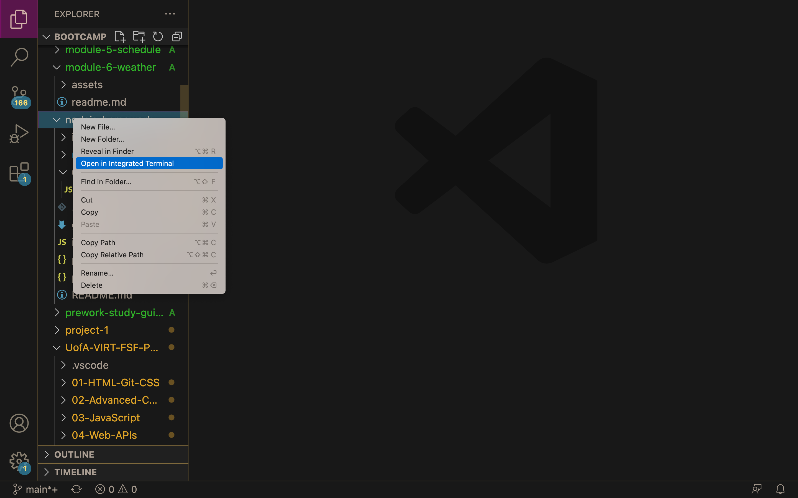
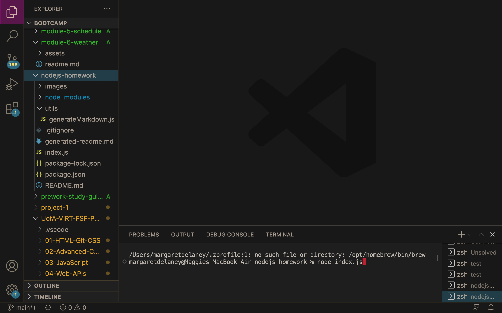
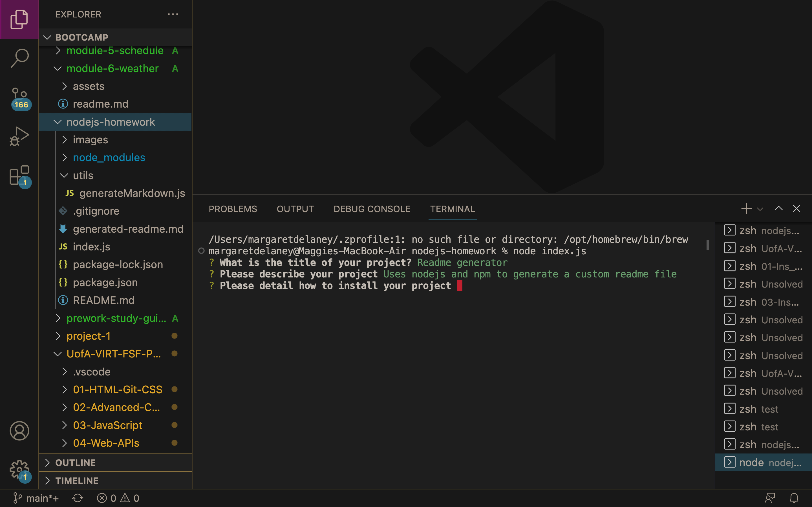
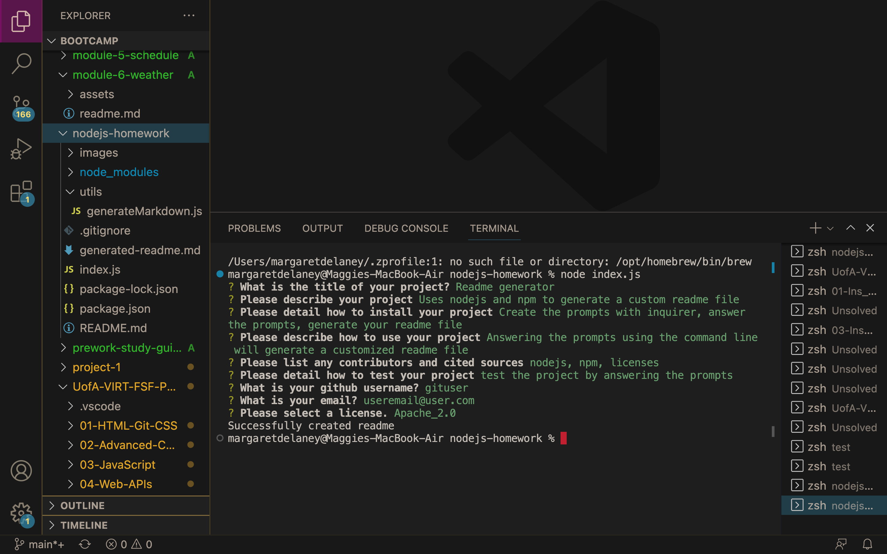
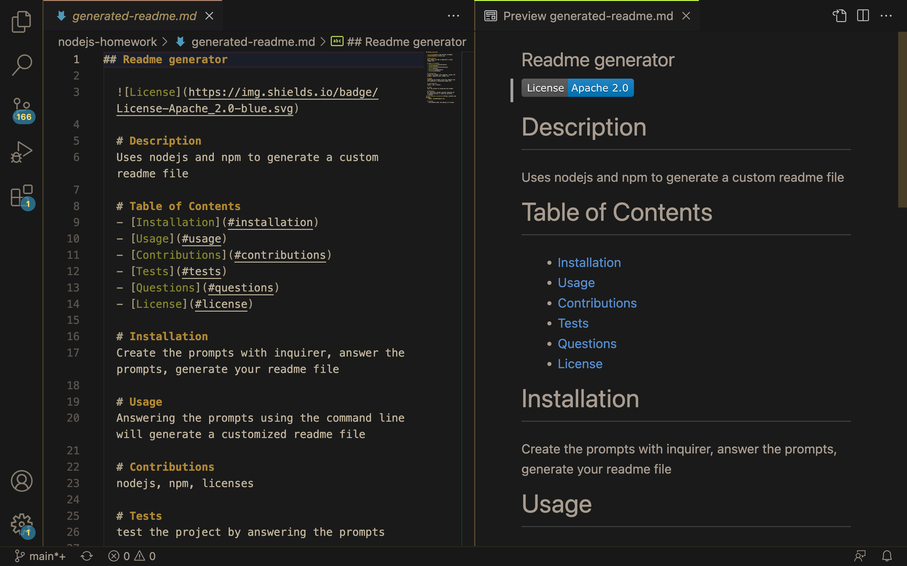

# Node.js Challenge: Professional README Generator

## Description

This project called for me to create a command-line application that dynamically generates a professional README.md file from a user's input.

This project meets the following acceptance criteria:

- GIVEN a command-line application that accepts user input, WHEN I am prompted for information about my application repository, THEN a high-quality, professional README.md is generated with the title of my project and sections entitled Description, Table of Contents, Installation, Usage, License, Contributing, Tests, and Questions
    - The generated README will include all of the above components

- WHEN I enter my project title, THEN this is displayed as the title of the README
    - The entered title will appear as the title of the generated readme

- WHEN I enter a description, installation instructions, usage information, contribution guidelines, and test instructions, THEN this information is added to the sections of the README entitled Description, Installation, Usage, Contributing, and Tests
    - When the user enters details for each section with the prompts, the details will then appear in the appropriate section in the generated readme

- WHEN I choose a license for my application from a list of options, THEN a badge for that license is added near the top of the README and a notice is added to the section of the README entitled License that explains which license the application is covered under
    - If a license is selected, the license badge will appear at the top of the readme. A License section will also populate with a notice for which license is being used.

- WHEN I enter my GitHub username, THEN this is added to the section of the README entitled Questions, with a link to my GitHub profile
    - When the user enters their github username, it is embedded within a link that will take you to their profile.

- WHEN I enter my email address, THEN this is added to the section of the README entitled Questions, with instructions on how to reach me with additional questions
    - The email address is populated to the Questions section of the generated readme

- WHEN I click on the links in the Table of Contents, THEN I am taken to the corresponding section of the README
    - The user is able to click on the links in the readme and be taken to the appropriate section.

## Installation

- This project provided starter code. First I worked in the index.js file to "require" the npm inquirer, the fs, and the "generateMarkdown" file to be utilized within the index.js.
- I then used inquirer to create prompts that populate to the command line and ask the user to provider input.
- Then a function is written after the prompts to generate the readme file based on the user input and creates the new file titled "generated-readme.md."
- Next, in the generateMarkdown.js file, a function is created to populate the skeleton of the readme file with ${} used to input the user answers to the inquirer prompts.
- Functions are then created to populate a badge, license link, and license section within the generated readme file. If a license is not selected, those sections are left blank.

## Usage

1. Navigate to the nodejs-homework file, right click and select "open in integrated terminal"

2. Run "node index.js"

3. Answer the prompts with the desired input to create your readme

4. Once complete, you should see a message "Successfully created readme."

5. Navigate back to the nodejs-homework folder and you should now see a "generated-readme.md" file

6. Open the file and you will see your generated readme, complete with license badge, table of contents with links, and all necessary sections

## Credits

Inquirer: https://www.npmjs.com/package/inquirer/v/8.2.4 
FullStack Blog: https://coding-boot-camp.github.io/full-stack/github/professional-readme-guide
Licenses: https://choosealicense.com/
& https://gist.github.com/lukas-h/2a5d00690736b4c3a7ba

## License

MIT License

Copyright (c) 2022 maggierdelaney

Permission is hereby granted, free of charge, to any person obtaining a copy
of this software and associated documentation files (the "Software"), to deal
in the Software without restriction, including without limitation the rights
to use, copy, modify, merge, publish, distribute, sublicense, and/or sell
copies of the Software, and to permit persons to whom the Software is
furnished to do so, subject to the following conditions:

The above copyright notice and this permission notice shall be included in all
copies or substantial portions of the Software.

THE SOFTWARE IS PROVIDED "AS IS", WITHOUT WARRANTY OF ANY KIND, EXPRESS OR
IMPLIED, INCLUDING BUT NOT LIMITED TO THE WARRANTIES OF MERCHANTABILITY,
FITNESS FOR A PARTICULAR PURPOSE AND NONINFRINGEMENT. IN NO EVENT SHALL THE
AUTHORS OR COPYRIGHT HOLDERS BE LIABLE FOR ANY CLAIM, DAMAGES OR OTHER
LIABILITY, WHETHER IN AN ACTION OF CONTRACT, TORT OR OTHERWISE, ARISING FROM,
OUT OF OR IN CONNECTION WITH THE SOFTWARE OR THE USE OR OTHER DEALINGS IN THE
SOFTWARE.